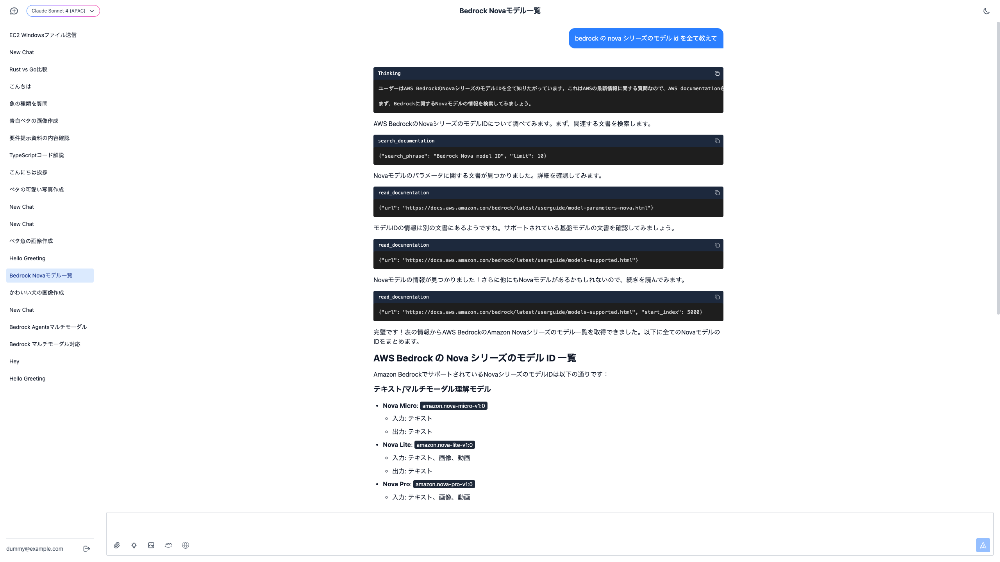
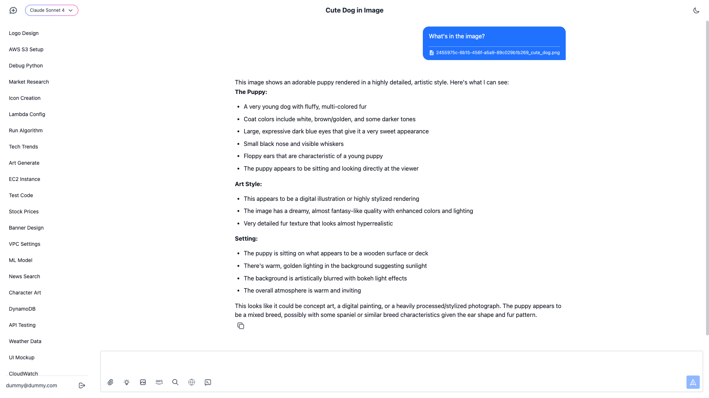
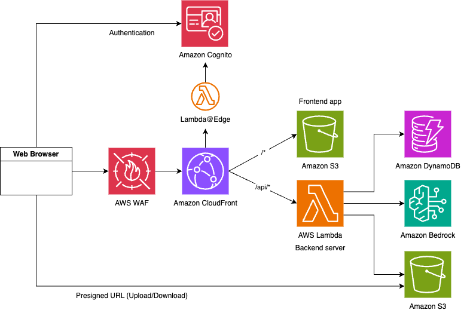

<div align="center">

# 🤖 Strands Agents Chat

*A full-stack AI chat application powered by Amazon Bedrock and Strands Agents*

[](https://aws.amazon.com/)
[](https://python.org/)
[](https://reactjs.org/)
[](https://typescriptlang.org/)

</div>

---

## 📸 Screenshots

<div align="center">
  
  
</div>

---

## ✨ Features

This is a sample application that serves as a base implementation for chat applications utilizing **Strands Agents**.

🏗️ **Simple Architecture** - Clean, maintainable codebase with serverless scalability

🎨 **Rich UI/UX** - Polished chat interface with intuitive user experience

🔧 **Extensible with Strands Agents** - Ready for customization with MCP, A2A, Multi Agents, and more

📱 **Responsive Design** - Optimized for both desktop and mobile usage

---

## 🏛️ Architecture

<div align="center">
  
</div>

---

## 🛠️ Built-in Tools

| Tool | Description | Technology |
|------|-------------|------------|
| 💬 **Multi-modal Chat** | Support for images, videos, and documents | Amazon Bedrock |
| 🧠 **Deep Reasoning** | Advanced AI reasoning for complex problem solving | Amazon Bedrock |
| 🎨 **Image Generation** | AI-powered image creation | Nova Canvas MCP |
| 📚 **AWS Documentation Search** | Search and access AWS documentation | AWS Documentation MCP |
| 🔍 **Web Search** | Real-time web search capabilities | Tavily API |

---

## 🚀 Deployment Guide

### Step 1: (Optional) Create Tavily API Key Secret

<details>
<summary>Click to expand Tavily API setup instructions</summary>

1. Open [AWS Secrets Manager](https://console.aws.amazon.com/secretsmanager)
2. Click **"Store a new secret"**
3. Select **"Other type of secret"**
4. Choose **"Plaintext"** and paste your Tavily API Key
5. Create the secret and copy the **Secret ARN**

</details>

### Step 2: (Required) Configure Parameters

```bash
# Navigate to CDK directory
cd cdk

# Install dependencies
npm ci

# Copy the parameter template
cp parameter.template.ts parameter.ts

# Edit parameter.ts with your configuration
# Note: If tavilyApiKeySecretArn is null, web search tool will be disabled
```

### Step 3: (Required) Deploy with CDK

```bash
# Bootstrap CDK (run once per AWS account/region)
npx cdk bootstrap

# Deploy all stacks
npx cdk deploy --all --require-approval never
```

🎉 **Access your application** using the `WebUrl` from the deployment output!

---

## 💻 Development

### Frontend Development

For frontend development, you can run the development server locally while connecting to your deployed backend:

```bash
# Navigate to web directory
cd web

# Install dependencies
npm ci

# Start development server
npm run dev
```

The development server will:
- 🚀 Start at `http://localhost:5173`
- 🔗 Automatically import necessary values from the `StrandsChat` stack output
- 🔄 Enable hot reload for rapid development

### Pre-commit Checks

Before committing your changes, ensure code quality by running the pre-check script:

```bash
# Run pre-commit checks
./pre_check.sh
```

This script will validate your code formatting, run tests, and ensure everything is ready for commit.

---

## ⚙️ Customization

### 🛡️ WAF Configuration (Access Restrictions)

The WAF settings are defined in `cdk/lib/waf-stack.ts`. Customize this file to modify security rules.

> **Default behavior**: Allows access from all IP addresses and countries

**IP Restriction Example:**
```typescript
// Add IP allowlist in waf-stack.ts
const ipSet = new wafv2.CfnIPSet(this, 'AllowedIPs', {
  addresses: ['192.168.1.0/24', '10.0.0.0/8'],
  ipAddressVersion: 'IPV4',
  scope: 'CLOUDFRONT'
});
```

**GEO Restriction Example:**
```typescript
// Add country-based access control in waf-stack.ts
// Add geoMatchStatement to your WAF rule's statement
const geoRule = new wafv2.CfnWebACL.RuleProperty({
  name: 'GeoRestriction',
  priority: 1,
  statement: {
    geoMatchStatement: {
      countryCodes: ['US', 'JP', 'CA'], // Allow only these countries
    },
  },
  action: {
    allow: {},
  },
  visibilityConfig: {
    sampledRequestsEnabled: true,
    cloudWatchMetricsEnabled: true,
    metricName: 'GeoRestriction',
  },
});
```

> **Country Codes**: Use ISO 3166-1 alpha-2 country codes (e.g., 'US' for United States, 'JP' for Japan)

### 🔐 Disable Cognito Signup

If you want to disable the Cognito signup functionality and restrict user registration:

**Backend Configuration:**
1. Open `cdk/lib/strands-chat-stack.ts`
2. Find the UserPool configuration
3. Change `selfSignUpEnabled` from `true` to `false`

```typescript
// In strands-chat-stack.ts
const userPool = new UserPool(this, 'UserPool', {
  selfSignUpEnabled: false, // Change from true to false
  // ... other configurations
});
```

**Frontend Configuration:**
1. Open `web/src/components/AuthWithUserPool.tsx`
2. Add the `hideSignup={true}` option to the `<Authenticator>` component

```tsx
// In AuthWithUserPool.tsx
<Authenticator hideSignup={true}>
  {/* ... existing content */}
</Authenticator>
```

> **Note**: After making these changes, redeploy the CDK stack for backend changes to take effect.

---

## 🏗️ Technology Stack

<div align="center">

| Layer | Technology | Purpose |
|-------|------------|---------|
| **Frontend** | React 19 + TypeScript + Tailwind CSS | Modern, responsive UI |
| **Backend** | Python 3.13 + FastAPI + Strands Agents | AI-powered API |
| **Infrastructure** | AWS CDK + Lambda + DynamoDB + S3 | Serverless architecture |
| **AI/ML** | Amazon Bedrock + Claude | Advanced language models |
| **Authentication** | AWS Cognito | Secure user management |

</div>

---

## 📁 Project Structure

```
├── 🐍 api/           # Python FastAPI backend
├── ☁️ cdk/           # AWS CDK infrastructure
├── ⚛️ web/           # React frontend application
└── 📖 README.md      # Project documentation
```

## Security

See [CONTRIBUTING](/CONTRIBUTING.md#security-issue-notifications) for more information.

## License

This library is licensed under the MIT-0 License. See the LICENSE file.
